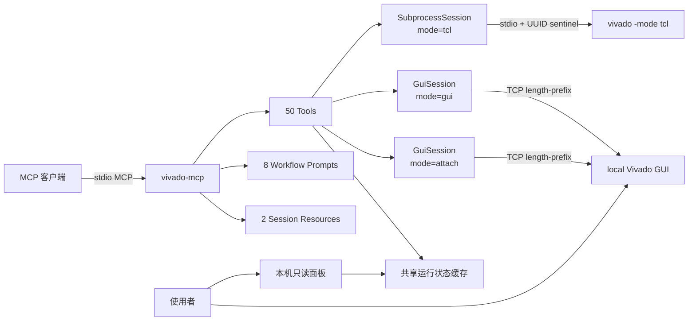

# 贡献指南

Otter Vivado 延续 NJ 的 [vivado-mcp](https://github.com/mapleleavessssssss-wq/vivado-mcp)，
保留作者、Apache-2.0 许可与上游贡献关系。以下说明区分本产品日常开发与上游投稿。

## 开发环境搭建

```bash
# 克隆仓库
git clone -b main https://github.com/otter-fpga-lab/otter-vivado.git
cd otter-vivado

# 创建虚拟环境
python -m venv .venv
source .venv/bin/activate  # Linux/macOS
# 或 .venv\Scripts\activate  # Windows

# 安装开发依赖
pip install -e ".[dev]"
```

## 代码风格

- 使用 [ruff](https://docs.astral.sh/ruff/) 进行代码检查和格式化
- 行宽限制 100 字符
- 源码注释和 docstring 使用中文
- 遵循 PEP 8 命名规范

```bash
# 检查
ruff check src/ tests/

# 自动修复
ruff check --fix src/ tests/
```

## 架构



**核心协议**：
- **subprocess 模式**：`catch + UUID sentinel`（stdio 分帧，修复了 0.1.0 的行顺序 bug）
- **GUI/attach 模式**：TCP length-prefix framing（4 字节 BE + UTF-8 payload）
- 命令通过十六进制编码传输，避免传输层误解释命令内容，并覆盖含空格、中文和特殊字符的路径
- 每个 session 同时只拥有一个在途响应；调用超时不会释放协议所有权，避免迟到响应污染下一条命令

## Tcl 协议规则（改 `src/vivado_mcp/vivado/` 或 `tcl_scripts.py` 前必读）

本项目通过 sentinel 前缀协议解析 Vivado 输出，这一层的 bug 最难追（曾有命名空间冲突 bug 潜伏了十个版本）。硬规则：

1. **`VMCP_OK:` / `VMCP_ERR:` / `VMCP_END:` 是 session 层 sentinel，应用层 Tcl 脚本禁止输出这三个前缀**。新加输出前缀一律 `VMCP_<语义>:`（如 `VMCP_PROJ:`、`VMCP_IP_INFO:`），加之前先 `grep -rn "VMCP_" src/` 确认不撞名
2. Tcl 临时变量一律 `__` 双下划线前缀，防止与用户会话里的 Tcl 变量重名
3. Tcl error 用 `catch` 接住并以 `VMCP_<语义>_ERR:` 前缀输出，不要让裸异常穿透到 session 协议层
4. `puts` 输出必须带前缀——不带前缀的行会被原样转发给 AI，产生噪音
5. 长 Tcl 片段集中放 `tcl_scripts.py`：走 `.format()` 传参的模板里 Tcl 花括号写 `{{ }}`，不走 `.format()` 的用单 `{ }`（文件内有注释标注哪个是哪个）
6. stdio（`session.py`）与 TCP/GUI（`gui_session.py`）是两条独立传输路径，改一边必须确认另一边不受影响

## 测试

```bash
# 运行所有测试（不需要 Vivado 安装）
pytest

# 运行特定测试
pytest tests/test_tcl_utils.py -v
```

## 本产品日常开发

用户已授权的本仓产品工作默认在 `main` 进行，按可审阅工作块提交；实际并行修改、需要
隔离的试验或向上游投稿时再使用独立分支。接续已有任务时先看 [TASK.md](TASK.md)，
保留现有分支/PR 的工作，不为切回默认分支丢弃未完成变更。

1. 更新前执行 `git fetch origin`，核对 origin、HEAD、工作树与远端差异，保留同期修改；
   不使用 reset 或强制覆盖回到历史基线。
2. 阅读受影响实现，完成必要修改与定向验证。按影响范围运行测试；Tcl/会话改动同时考虑
   GUI 与无头路径，没有 EDA/Windows 时明确现场待测范围。
3. 把已完成内容、实际提交、验证结果与下一步写入产品 TASK，及时本地提交；推送按用户当前授权。
4. 需要隔离时建立或接续任务分支/PR；合并按用户当前授权执行，不自动发布包或操作设备。

## 反馈复现材料

产品讨论入口见 [README 的反馈](README.md#反馈与-bug-提交)。可让正在使用的客户端
整理一份 Markdown：环境、期望/实际行为、复现调用序列和相关日志，并记录：

- 操作系统构建号、客户端类型/版本、Python 版本、`vivado-mcp version` 与源码提交；
- 实际 Vivado 版本、安装路径、`gui/tcl/attach` 模式，以及相关工具名；
- 当前任务的 session/run、工程/器件与报告阶段，只附问题需要的日志片段。

Vivado 版本优先从已有空闲会话的 `version -short` 取得；忙时使用已有日志头，无法确认
就记未知。`.xpr` 的 Project Version 是文件格式信息，不代表实际运行版本。
优先复用 `get_run_snapshot`、已有错误和日志；收集反馈不重跑构建、仿真或设备动作。
公开材料移除凭据、私人主机地址和未授权客户数据。可用 `[bug]`、`[feature]` 或 `[docs]`
标明问题类型；整理材料不自动发送消息或创建远端内容。

## 向原上游投稿

1. 在 [原上游](https://github.com/mapleleavessssssss-wq/vivado-mcp) 的 fork/贡献关系下准备通用修复。
2. 使用独立贡献分支，保留已有作者、许可、历史与贡献分支，不将产品专属包装混入上游修复。
3. 遵循上游当前贡献要求，完成相关 `ruff check` 与测试，提交描述问题、行为变化和验证范围的 PR。

## 安全相关

安全反馈先与维护者确认私密提交渠道，不在公开讨论中附带漏洞利用细节、凭据或客户数据。
